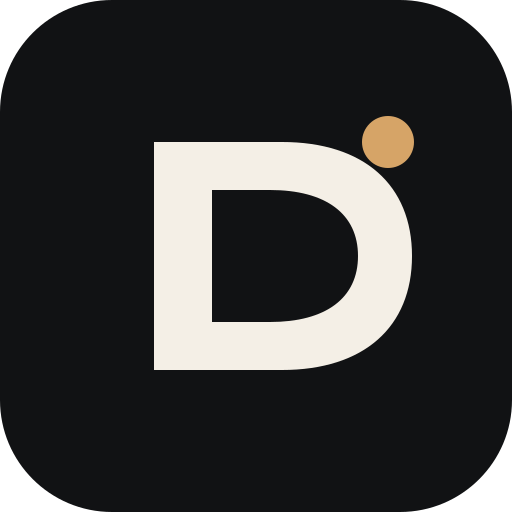
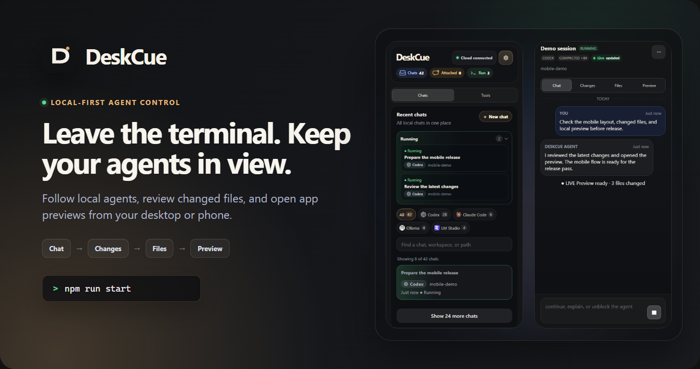

<h1>
  
  DeskCue — your local control panel for AI agents
</h1>

<p align="center">
  
</p>

<p align="center">
  <a href="https://deskcue.io"></a>
  <a href="#project-status"></a>
  <a href="./LICENSE"></a>
  <a href="./docs/architecture.md"></a>
</p>

DeskCue lets you keep an eye on agent work when you step away from the terminal.
Follow the conversation, see what tools are doing, review changed files, and
open the app preview from your desktop or phone.

Keep using Codex, Claude Code, Ollama, LM Studio, or a generic CLI. DeskCue is
open-source and local-first, and it works with the tools and accounts you
already have. It is not an LLM provider, model host, or cloud IDE.

**[Quick start](#quick-start) · [Installation](./docs/installation.md) ·
[Architecture](./docs/architecture.md) · [Security](./SECURITY.md) ·
[Contributing](./CONTRIBUTING.md)**

## Quick start

Clone the repository and start the production dashboard:

```bash
git clone https://github.com/AleksandrKornev/DeskCue.git
cd DeskCue
npm install
npm run start
```

Open [http://localhost:4100](http://localhost:4100). No account or pairing step
is needed on this loopback page.

## See the mobile review loop

This 14-second walkthrough follows an agent, reviews its files, and opens the
app preview from a phone.

https://github.com/user-attachments/assets/761d78f8-6b47-4c8e-b139-bbb7a43c8681

## Your first five minutes

1. Add a workspace by entering the path to a project on this machine
2. Open the workspace and choose an existing agent session or start a supported
   agent/chat
3. Follow the conversation and tool activity from the agent view
4. Open **Changes** to review the diff and **Files** to inspect the working tree
5. If the project runs a web app, enter its local port in **Preview** and inspect
   it without leaving DeskCue

That is the core DeskCue loop: **workspace -> agent/chat -> Changes, Files, and
Preview**. You do not need DeskCue Cloud or a cloud account for it.

## Why I built DeskCue

AI agents can keep working while I step away from the terminal, but I still want
to know what they changed before I give them the next instruction. I built
DeskCue to put that review loop in one place: the conversation, tool activity,
files, diff, logs, and the app being built.

The local dashboard is the product, not a fallback. It keeps the agent, model,
source code, and credentials on the machine where they already live. Remote
access through DeskCue Cloud is optional.

## What it does

- Discovers local Codex and Claude Code conversations
- Runs local chats through Ollama and LM Studio
- Starts generic CLI commands inside registered workspaces
- Shows live status, transcripts, tool activity, files, and changes
- Relays local web previews
- Sends follow-up prompts and stop requests to supported sessions
- Delivers Web Push, ntfy, Gotify, Telegram, and webhook notifications
- Gives each paired browser or phone its own revocable credential

## Project status

DeskCue is a source-installed public alpha. Windows and Ubuntu are the currently
tested platforms; macOS has not been fully verified yet. The current focus is
simple: make the local review-and-control loop reliable for one developer.

## Requirements

- Node.js `22.22` or newer within `22.x`, or Node.js `24.x`
- npm `10+`
- Git in `PATH` for branch and diff features

DeskCue installs prebuilt PTY and SQLite binaries for the supported Node/OS/CPU
matrix. See [Installation](./docs/installation.md) for platform notes and
troubleshooting.

## Development

`npm run start` builds every workspace and serves the production dashboard from
the daemon. For frontend development, use:

```bash
npm run dev
```

The daemon remains on port `4100`; the Vite dashboard runs on port `4173`.

Useful checks:

```bash
npm run verify
npm run doctor
npm run smoke:daemon
npm run smoke:web
```

## Troubleshooting

- If the dashboard does not open, run `npm run doctor` and check that port
  `4100` is available
- If installation fails around PTY or SQLite dependencies, confirm that Node is
  a supported version and see [Installation](./docs/installation.md)
- If Codex or Claude Code sessions are missing, confirm their CLIs have created
  sessions for the current user and that the workspace path is correct
- If a local model chat cannot connect, start the Ollama or LM Studio server and
  verify its local API is reachable
- If a phone cannot connect, keep authentication enabled and confirm that both
  devices can reach the machine over the same trusted network. See
  [Security](./docs/security.md) before changing bind or proxy settings

## Optional DeskCue Cloud

DeskCue Cloud is an optional public-alpha connector for reaching the daemon from
another device when a direct connection is not practical. You do not need a
Cloud account or connection for the local dashboard.

Cloud keeps a small session-status projection, not source code, paths,
transcripts, diffs, prompts, or provider secrets. Session and workspace labels
are included only when name sharing is enabled locally. When the daemon is
online, permissions you grant can relay reads, live updates, workspace files,
prompts, interrupts, and Preview traffic. Remote Files stays inside the same
registered-workspace boundary as the local Files view.

DeskCue Cloud is not designed to inspect or store relayed content. It handles
that data only while forwarding requests and responses. The current relay is
not end-to-end encrypted, so plaintext still passes through Cloud service memory
while it is being forwarded. The daemon remains in control of processes, files,
runtimes, permissions, and Preview networking.

You start the connection in the local dashboard and confirm it in the browser.
The [architecture guide](./docs/architecture.md#optional-cloud-boundary) explains
enrollment, capabilities, and the data plane in more detail.

## Supported runtimes

| Runtime | Current support |
| --- | --- |
| Codex | Discovery, transcript reading, attachments, and resume where supported |
| Claude Code | Discovery, transcript reading, and resume where supported |
| Ollama | DeskCue-owned local chats through the local Ollama API |
| LM Studio | DeskCue-owned local chats through the local LM Studio server |
| Generic CLI | Start a command in a workspace and stream its output |

Available actions depend on the runtime and the session. If DeskCue cannot
safely resume or interrupt a session, that action is simply unavailable.

## Local data and access

Source-checkout data lives under the Git-ignored `.deskcue-data/` directory. It
contains SQLite state, logs, local chat history, and hashed device credentials.

Start DeskCue normally:

```bash
npm run start
```

The daemon listens on `0.0.0.0:4100` for trusted-LAN access and enables
authentication by default. For loopback-only binding, custom origins, or a
reverse proxy, see [Environment configuration](./docs/environment.md) and the
[security guide](./docs/security.md). Do not expose the source-checkout daemon
directly to the public internet.

## Repository layout

```text
apps/
  cli/       Diagnostics and command-line entrypoint
  daemon/    Local API, process control, storage, and preview relay
  web/       React dashboard
packages/
  adapters/  Runtime adapter contracts and metadata
  protocol/  Shared wire contracts
docs/        Public architecture, setup, and security documentation
examples/    Local smoke-test helpers
```

## Documentation

- [Changelog](./CHANGELOG.md)
- [Documentation index](./docs/README.md)
- [Installation](./docs/installation.md)
- [Architecture](./docs/architecture.md)
- [Development](./docs/development.md)
- [Environment configuration](./docs/environment.md)
- [Security](./docs/security.md)
- [Notifications](./docs/notifications.md)
- [Distribution](./docs/distribution.md)
- [Roadmap](./docs/roadmap.md)
- [Contributing](./CONTRIBUTING.md)

## Known limitations

- There is no packaged installer or container distribution yet
- Codex and Claude Code prompt delivery is designed to survive a graceful
  daemon restart. Ambiguous crash outcomes are reconciled from native
  transcripts and are never resent automatically
- Generic CLI processes and DeskCue-owned local-model generations may not
  survive a daemon or runtime crash
- Agent attach, resume, interrupt, and compaction support depend on the runtime
- Preview is path-based, so service workers, WebTransport, and other
  origin-sensitive features are not universally supported
- DeskCue Cloud is still a public alpha. Preview content gets a short-lived,
  lease-scoped HTTPS origin, but wildcard Preview origins currently share the
  registrable `deskcue.io` domain with the main app. A dedicated content domain
  is planned. Cloud Preview is limited to the target and network mode selected
  in DeskCue; it is not an arbitrary API proxy or host-process controller
- The Cloud UI for DeskCue-owned Ollama and LM Studio chats remains a separate
  product integration

## License

Apache-2.0
